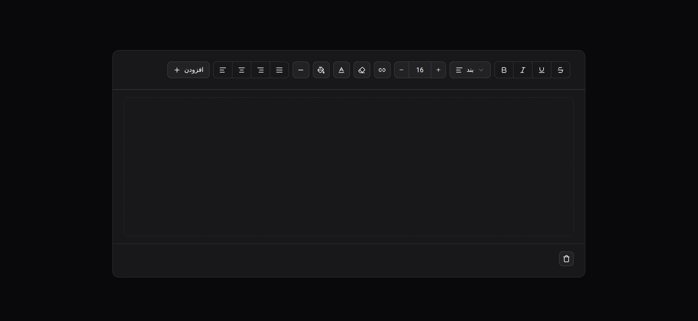
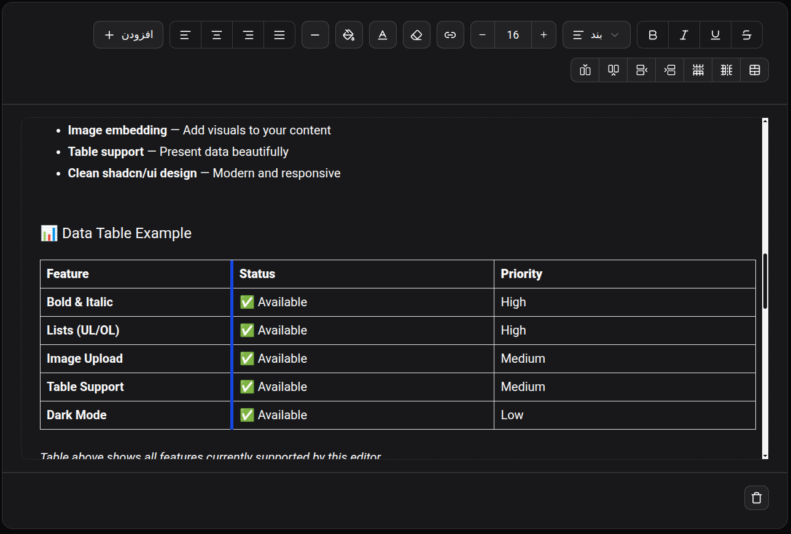
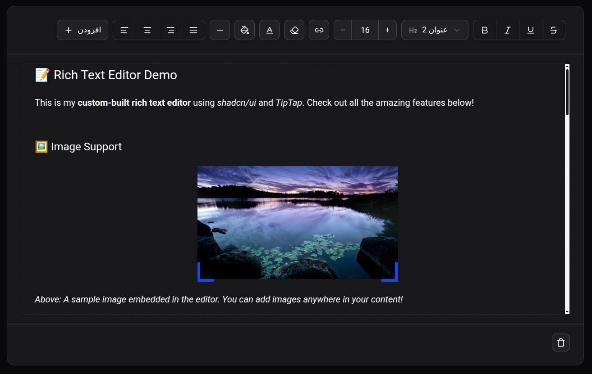

# ✍️ Rich Text Editor — Custom Built with shadcn/ui & TipTap



> A clean, customizable rich text editor that combines the power of TipTap with the elegant design of shadcn/ui.  
> **This is not a boilerplate — I customized the toolbar, styling, extensions, and UX to fit real-world needs.**

## 🎯 Why This Editor?

I needed a rich text editor that:

- **Looks and feels like shadcn/ui** — not just a generic editor with basic styling
- **Includes only what I actually use** — no bloat, no unnecessary toolbar buttons
- **Supports dark/light mode out of the box** — because shadcn/ui already does this beautifully
- **Is easy to customize** — colors, spacing, and component behavior are all under my control

So I built this editor from scratch using TipTap and dressed it entirely with shadcn/ui components.

## ✨ Features

- 🎨 **Full shadcn/ui styling** — every button, menu, and input uses shadcn components
- 🧩 **Trimmed-down extensions** — only useful ones (bold, italic, lists, headings)
- 🛠️ **Custom toolbar layout** — reorganized button order and grouping
- 🌗 **Dark/light mode ready** — theme-aware right out of the box
- 📦 **Modular structure** — easy to import and use anywhere
- ⚡ **TypeScript support** — full type safety
- 🔧 **Highly customizable** — easy to add/remove extensions

## 🧰 Tech Stack

- **React 19 + TypeScript** — type-safe and modern
- **TipTap** — headless editor framework
- **shadcn/ui** — component library for the UI
- **Tailwind CSS** — utility-first styling
- **Vite** — fast builds and HMR

## 📸 Live Demo & Screenshots

<div align="center">


</div>


## 🚀 Getting Started

### Prerequisites

- Node.js (v18 or later)
- npm or yarn or pnpm

### Installation

```bash
# 1. Clone the repository
git clone https://github.com/miladmxm/rich-text-editor-shadcn-tiptap.git
cd rich-text-editor-shadcn-tiptap

# 2. Install dependencies
npm install

# 3. (Optional) Initialize shadcn/ui if not already set up
npx shadcn@latest init
npx shadcn@latest add button tooltip toggle

# 4. Run the development server
npm run dev
```

```typescript
import RichEditor from "@/components/rich-text-editor";

function MyForm() {
  const [content, setContent] = useState({});

  return (
    <div className="space-y-4">
      <label className="text-sm font-medium">
        Write your content:
      </label>
      <RichEditor
        content={content}
        onUpdate={setContent}
      />
    </div>
  );
}
```
